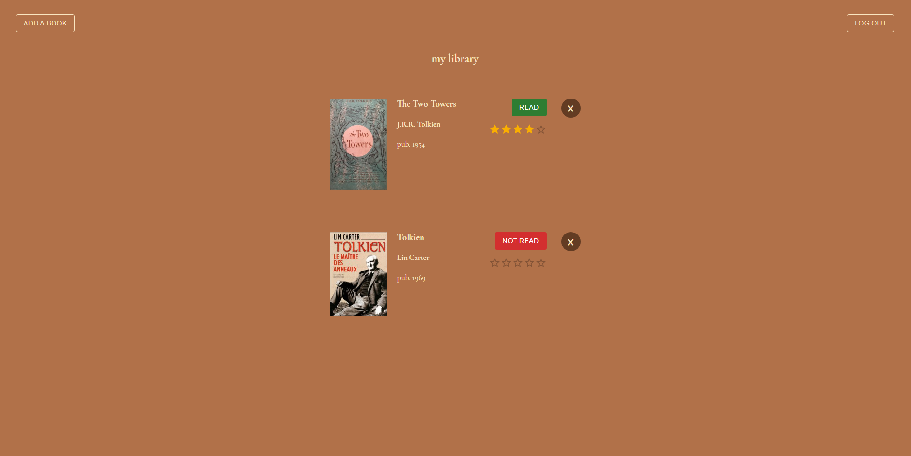

# bookmark
bookmark is an app that allows you to search for and manage your library of books. Powered by the [Open Library Search API](https://openlibrary.org/dev/docs/api/search/). 

Live site: https://bookmark-app-frontend.herokuapp.com/

## Problem Statement and End User
This app is designed for those who love to read! It allows people to search for and organize books users are reading/plan on reading.

## Features
- Login to save your books (Powered by Auth0)
- Search for books
  - Allows you to seach by author, title, etc.
- Add books to your library
- Modify your ratings and read status

## Screenshots
landing page

add book page

library page

## Built with
- [Open Library Search API](https://openlibrary.org/dev/docs/api/search/)
- [Auth0](https://auth0.com/)
- [ReactJS](https://reactjs.org/) 
- [Spring Boot](https://spring.io/projects/spring-boot)
- [MySQL](https://www.mysql.com/)

## Future Development Goals
- More descriptive book information
- More options to modify

## Author
Github: [@VivianLi1](https://github.com/VivianLi1)

LinkedIn: [Vivian Li](https://www.linkedin.com/in/vivian-li-39188b171/)
